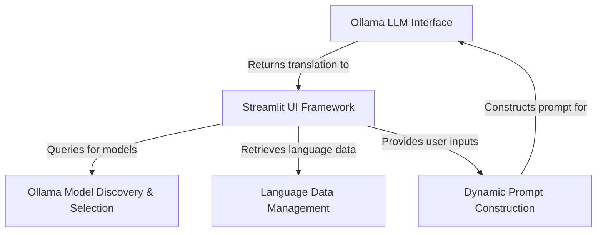
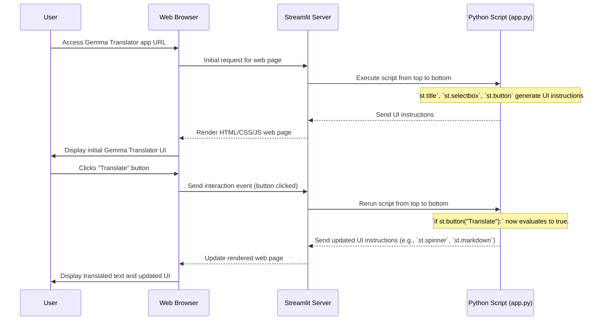
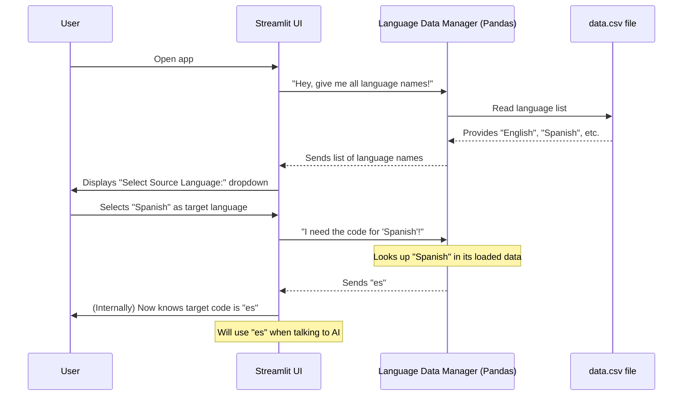
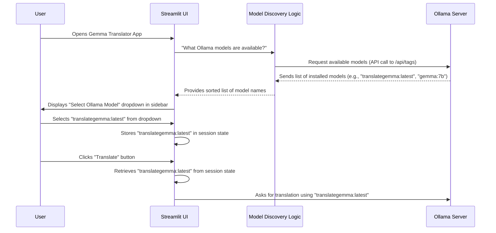
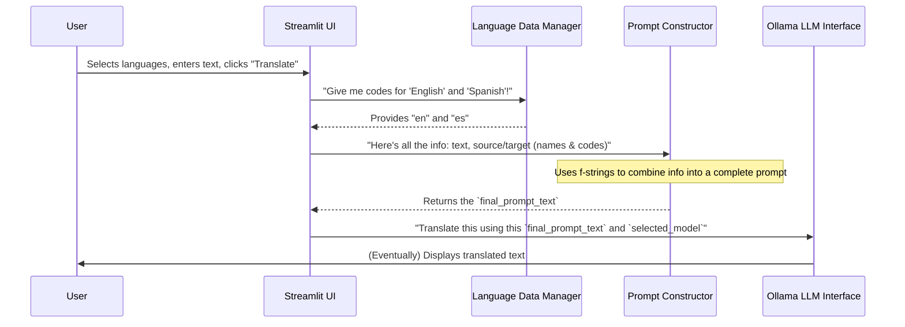

Gemma-Translator

The **Gemma Translator** is a user-friendly application designed to facilitate **text translation** between various languages using a locally run **AI language model** powered by Ollama. It features an intuitive *Streamlit web interface* where users can effortlessly select source and target languages, input text, choose from available AI models, and receive immediate, accurate translations.


## Visual Overview



## Chapters

1. [Streamlit UI Framework
](01_streamlit_ui_framework_.md)
2. [Language Data Management
](02_language_data_management_.md)
3. [Ollama Model Discovery & Selection
](03_ollama_model_discovery___selection_.md)
4. [Dynamic Prompt Construction
](04_dynamic_prompt_construction_.md)
5. [Ollama LLM Interface
](05_ollama_llm_interface_.md)

# Chapter 1: Streamlit UI Framework

Welcome to the first chapter of the `Gemma-Translator` tutorial! In this chapter, we'll embark on an exciting journey into the world of Streamlit. Imagine you have a brilliant idea for an application, like our `Gemma-Translator`, which can translate text between different languages using powerful AI. How do you let people use it? How do you create the buttons, text boxes, and dropdown menus they need to interact with your creation?

This is where the **Streamlit UI Framework** comes in. It's like having a magic toolbox that lets you build beautiful, interactive web applications using *only* Python code, without needing to learn complex web development languages like HTML, CSS, or JavaScript.

## Why Streamlit?

Think about our `Gemma-Translator` project. We want users to be able to:
1.  **Select** a source language (e.g., English).
2.  **Select** a target language (e.g., Spanish).
3.  **Type** or paste the text they want to translate.
4.  **Click** a button to start the translation.
5.  **See** the translated text displayed clearly.

Building a web page with all these elements from scratch can be very complicated. Streamlit solves this problem by providing simple Python commands for each UI element. It lets us focus on the core logic of our translator (how it translates) rather than getting bogged down in web design intricacies. It's the "canvas and toolkit" for our application's visual structure.

## What is Streamlit? Your Python to Web App Magic Tool

At its heart, Streamlit is an open-source Python library that transforms data scripts into shareable web apps in minutes. It's especially popular for data science and machine learning projects because it makes creating interactive dashboards and interfaces incredibly easy.

Let's look at some core ideas:

*   **User Interface (UI)**: This is everything you see and interact with on a screen – buttons, text, images, forms. Streamlit helps us define this UI.
*   **Widgets**: These are the interactive components of a UI, like buttons (`st.button`), text input boxes (`st.text_area`), and dropdown menus (`st.selectbox`).
*   **Pythonic**: Streamlit uses standard Python syntax, so if you know Python, you already know how to use Streamlit!
*   **Automatic Refresh**: When you interact with a Streamlit app (e.g., click a button or change a selection), the entire Python script runs again from top to bottom to update the display. Streamlit is smart enough to remember previous inputs using something called "session state," which we'll touch upon later.

## Building Our Translator's Look and Feel

Let's see how we use Streamlit to create the user interface for our `Gemma-Translator`.

### 1. Setting Up Your Page

Every Streamlit app starts with importing the library and setting some basic page configurations.

```python
# app.py (simplified)
import streamlit as st

# This makes our page look nice, setting a title for the browser tab
# and centering the content on the page.
st.set_page_config(page_title="Gemma Translator", layout="centered")

# This adds a big, bold title to our application page.
st.title("Ollama Gemma Translator 🌐")
```

**Explanation:**
*   `import streamlit as st`: This is like saying, "Hey Python, I want to use all the tools from the Streamlit library, and I'll refer to it as `st` for short."
*   `st.set_page_config(...)`: This command configures the overall look of your web page. `page_title` is what appears in your browser tab, and `layout="centered"` tells Streamlit to put the main content in the middle of the screen.
*   `st.title(...)`: This is how you add a prominent heading to your application, making it clear what the app is about.

### 2. Getting User Input: Dropdowns and Text Boxes

Our translator needs to know which languages to translate between and what text to translate. Streamlit provides easy-to-use "widgets" for this.

```python
# app.py (simplified)
# ... (previous code) ...

# Create a dropdown menu for selecting the source language.
# We're using example languages for now.
source_language = st.selectbox("Select Source Language:", ["English", "Spanish", "French"])

# Create another dropdown for the target language.
target_language = st.selectbox("Select Target Language:", ["English", "Spanish", "French"])

# Create a multi-line text box for the user to type or paste text.
text_to_translate = st.text_area(label="Enter Text to Translate:")
```

**Explanation:**
*   `st.selectbox(...)`: This widget creates a dropdown menu. The first argument is the label (what the user sees), and the second is a list of options. Whatever the user selects gets stored in the `source_language` or `target_language` variable.
*   `st.text_area(...)`: This creates a larger text box suitable for longer pieces of text. The `label` argument tells the user what to type here. The text entered by the user is stored in `text_to_translate`.

### 3. Triggering Actions: The Translate Button

Once the user has selected languages and entered text, they need a way to tell the app to perform the translation.

```python
# app.py (simplified)
# ... (previous code) ...

# Create a button.
if st.button("Translate"):
    # This code block will ONLY run when the "Translate" button is clicked.
    st.write("You clicked the Translate button! Translation logic would go here.")
    # In our actual Gemma-Translator, this is where the AI translation process starts.
```

**Explanation:**
*   `st.button(...)`: This creates a simple button. The text inside the button is "Translate".
*   The `if st.button("Translate"):` line is special. When the button is clicked, Streamlit reruns your entire script, and this `if` condition becomes `True`, allowing the code inside it to execute. This is where we'll put our core translation logic later.

### 4. Displaying Results and Feedback

After translation, we need to show the result and give feedback to the user (e.g., "translating..." or "error").

```python
# app.py (simplified)
# ... (previous code) ...

if st.button("Translate"):
    # Simulate a translation process
    with st.spinner("⏳ Translating..."): # Shows a "Translating..." message with a spinner
        # Imagine complex AI translation happening here for a few seconds
        import time
        time.sleep(2) # Simulate work

    st.subheader("📌 Translation Results") # Adds a smaller heading
    st.markdown("This is your **translated text!**") # Displays the actual translation

    # Example of showing error/warning messages
    # st.error("Oops! Something went wrong with translation.")
    # st.warning("Please enter some text to translate.")
```

**Explanation:**
*   `with st.spinner("..."):`: This is a "context manager." While the code inside this block is running, Streamlit displays a loading spinner with your message, making the app feel more responsive.
*   `st.subheader(...)`: Similar to `st.title`, but for smaller headings, perfect for labeling sections like "Translation Results."
*   `st.markdown(...)`: This is a powerful tool to display text, especially if you want to use **bold**, *italics*, or other Markdown formatting.
*   `st.error(...)` and `st.warning(...)`: These are useful for displaying important messages to the user in a visually distinct way (red for errors, yellow for warnings).

### 5. Organizing with a Sidebar

Streamlit also allows you to put elements in a sidebar for better organization, which is perfect for settings like model selection in our `Gemma-Translator`.

```python
# app.py (simplified)
# ... (previous code) ...

# Add a subheader to the sidebar
st.sidebar.subheader("⚙️ Model Settings")

# Add a dropdown for model selection in the sidebar
model_choice = st.sidebar.selectbox("Select Ollama Model", ["translategemma:latest", "other_model:v1"])
```

**Explanation:**
*   Any Streamlit command prefixed with `.sidebar` (e.g., `st.sidebar.subheader`, `st.sidebar.selectbox`) will render that widget in a collapsible sidebar on the left side of your application, keeping your main content clean.

## How Streamlit Works Under the Hood

You might be wondering how Streamlit turns your Python script into a dynamic web page that updates automatically. Let's trace the typical flow:



**Step-by-step breakdown:**

1.  **Start the Server**: When you run your `app.py` script using `streamlit run app.py`, Streamlit starts a local web server.
2.  **Initial Load**: When you open your app in a web browser, the browser sends a request to the Streamlit server.
3.  **Script Execution**: The Streamlit server executes your `app.py` script *from top to bottom*. Every `st.` command encountered (like `st.title`, `st.selectbox`, `st.button`) tells Streamlit what UI elements to put on the page.
4.  **Render UI**: Streamlit collects all these UI instructions and sends them to your web browser, which then displays the beautiful web page.
5.  **User Interaction**: When you, the user, interact with the app (e.g., selecting a language, typing text, clicking the "Translate" button), your web browser sends an event back to the Streamlit server.
6.  **Re-run Script**: Crucially, Streamlit *reruns the entire `app.py` script from top to bottom again*! This is how Streamlit updates the app.
7.  **Update UI**: During this rerun, the values from your interactions (like the selected language) are automatically passed back into your script, and any `st.` commands generate updated UI instructions. Streamlit cleverly figures out what parts of the page need to change and sends only those updates to your browser.

This "rerun the entire script" model simplifies development immensely because you don't have to worry about managing complex states or callbacks – you just write your Python code as if it's a regular script, and Streamlit handles the web part.

## Conclusion

In this chapter, we've introduced the Streamlit UI Framework, which is the foundation of our `Gemma-Translator` application's visual interface. You've learned:

*   Why Streamlit is crucial for building interactive web apps using only Python.
*   How to use basic Streamlit widgets like `st.title`, `st.selectbox`, `st.text_area`, and `st.button` to construct the user interface.
*   How Streamlit works behind the scenes to turn your Python script into a dynamic web page that responds to user interactions.

With Streamlit, we can focus on the core translation logic, knowing that the user interface will be handled gracefully.

In the next chapter, we'll dive into **[Language Data Management](02_language_data_management_.md)**, exploring how our application handles and utilizes information about different languages to power the translation process.

# Chapter 2: Language Data Management

Welcome back to the `Gemma-Translator` tutorial! In the previous chapter, [Streamlit UI Framework](01_streamlit_ui_framework_.md), we learned how to build the visual parts of our application—the buttons, text boxes, and dropdown menus—that users interact with. We set up places for users to select a "Source Language" and a "Target Language."

But here's a thought: when a user sees "English" and "Spanish" in those dropdowns and picks one, how does our AI translation engine, like Ollama's `translategemma`, actually understand what language that is? Does it understand "English" or "Spanish"? Or does it need something more specific?

This is where **Language Data Management** comes into play.

## What is Language Data Management? Your Language Translator's Address Book!

Imagine you're trying to send a letter to a friend, but instead of their full name and address, you just have their nickname. The postal service won't know where to send it! Our `Gemma-Translator` has a similar problem with languages.

Users want to select languages using their common names, like "English," "Spanish," or "French." But behind the scenes, the powerful AI models often need a more precise, short code, like "en" for English, "es" for Spanish, or "fr" for French. These are called **ISO language codes**.

**Language Data Management** is the system that acts as our application's "language address book." It's responsible for:
1.  **Storing** all the language names (what users see).
2.  **Storing** their corresponding unique codes (what the AI understands).
3.  **Providing** this information to the application so it can:
    *   Show readable names in dropdowns.
    *   Convert a user-selected name into the correct code for the AI.

It makes sure that when a user selects "Spanish" for translation, our application correctly tells the AI to translate to `es`, ensuring the translation is accurate and specific.

## Why Do We Need Language Codes?

Think of it like this:

| What the User Sees (Language Name) | What the AI Needs (Language Code) |
| :--------------------------------- | :-------------------------------- |
| English                            | en                                |
| Spanish                            | es                                |
| French                             | fr                                |
| German                             | de                                |
| Hindi                              | hi                                |

The `translategemma` model, for example, is trained to understand these specific codes. If we just sent "Spanish," it might not be as precise as "es."

## How `Gemma-Translator` Manages Language Data

Our `Gemma-Translator` uses a very simple and effective way to manage this language data: a basic `.csv` file (a plain text file where values are separated by commas) and the powerful `pandas` library in Python.

### 1. The Language Data File (`data.csv`)

First, we need a place to store our language names and their codes. We do this in a file named `data.csv`. It's like a small, digital spreadsheet.

```csv
Language,Code
English,en
Spanish,es
French,fr
German,de
Italian,it
Portuguese,pt
Japanese,ja
Korean,ko
Chinese,zh
Hindi,hi
```
**Explanation:**
*   Each line is a different language.
*   `Language` is the name shown to the user.
*   `Code` is the special identifier the AI needs.

### 2. Loading the Data into Our App

To use this data in our Streamlit application, we load the `data.csv` file into something called a `DataFrame` using the `pandas` library. A `DataFrame` is like a table or spreadsheet that Python can easily work with.

```python
# app.py (simplified)
import pandas as pd
import streamlit as st # Already imported from Chapter 1

# ... (other Streamlit setup code) ...

# Fetch and prepare language data
# We load our 'data.csv' file into a DataFrame
data = pd.read_csv("data.csv")
df = pd.DataFrame(data)

# ... (rest of the app code) ...
```

**Explanation:**
*   `import pandas as pd`: This line imports the `pandas` library, giving it a shorter name `pd`.
*   `pd.read_csv("data.csv")`: This command reads our `data.csv` file and turns it into a `DataFrame`. Now, all our language information is easily accessible in `df`.

### 3. Populating the Dropdown Menus

Once the data is loaded, we can use it to fill our `st.selectbox` widgets (from [Chapter 1: Streamlit UI Framework](01_streamlit_ui_framework_.md)) with the language names.

```python
# app.py (simplified)
# ... (previous code loading data into 'df') ...

# Create a dropdown menu for selecting the source language.
# We use the 'Language' column from our DataFrame for options.
source_language = st.selectbox("Select Source Language:", df['Language'].unique())

# Create another dropdown for the target language.
target_language = st.selectbox("Select Target Language:", df['Language'].unique())

# ... (rest of the app code) ...
```

**Explanation:**
*   `df['Language'].unique()`: This is a clever `pandas` command. It takes the `Language` column from our `df` (DataFrame) and gives us a list of all the unique language names, perfect for populating our dropdown menus without duplicates.

### 4. Getting the Language Code

After the user selects a language name (e.g., "Spanish"), we need to find its corresponding code ("es").

```python
# app.py (simplified)
# ... (previous code for select boxes) ...

# Get the code for the selected source language
# We look up the 'Code' where 'Language' matches the selected source_language
source_code = df[df['Language'] == source_language]['Code'].values[0]

# Get the code for the selected target language
target_code = df[df['Language'] == target_language]['Code'].values[0]

# ... (now source_code and target_code can be used with the AI) ...
```

**Explanation:**
*   `df[df['Language'] == source_language]`: This part filters our `DataFrame`. It's like saying, "Show me only the row(s) where the 'Language' column matches the `source_language` the user picked."
*   `['Code'].values[0]`: From the filtered row, we then grab the value from the `Code` column. `.values[0]` ensures we get just the code itself, not a whole list.

Now, we have both the user-friendly names and the AI-friendly codes! These codes will be crucial when we construct the translation prompt for the AI in [Chapter 4: Dynamic Prompt Construction](04_dynamic_prompt_construction_.md).

## How Language Data Management Works (Under the Hood)

Let's trace the journey of language data in our `Gemma-Translator`.



**Step-by-step breakdown:**

1.  **App Starts / UI Needs Languages**: When the `Gemma-Translator` app starts, the Streamlit UI needs to fill its language dropdowns.
2.  **Request for Names**: The Streamlit UI asks the "Language Data Manager" (which is essentially our `pandas` code) for a list of all available language names.
3.  **Read Data File**: The `pandas` code reads the `data.csv` file, extracting all the entries.
4.  **Provide Names to UI**: `pandas` processes this data and provides a clean list of language names (like "English", "Spanish", "French") back to the Streamlit UI.
5.  **Display Dropdowns**: The Streamlit UI uses these names to populate the `st.selectbox` widgets, which the user sees.
6.  **User Selection**: The user interacts with the dropdowns and selects a language by its name, for example, "Spanish."
7.  **Request for Code**: The Streamlit UI then asks the "Language Data Manager" (our `pandas` code again) for the *code* that corresponds to the selected language name, "Spanish."
8.  **Lookup Code**: The `pandas` code quickly looks up "Spanish" in its loaded data and finds its associated code, "es."
9.  **Provide Code to UI**: The code "es" is sent back to the Streamlit UI.
10. **Ready for AI**: The Streamlit UI now has both the user-friendly name and the AI-friendly code, ready to pass to the AI model for translation.

This separation ensures that the user experience is intuitive (using language names) while the underlying system operates with the precision required by the AI (using language codes).

## Conclusion

In this chapter, we've explored the crucial concept of **Language Data Management**. You've learned:

*   Why it's important to manage language names and their corresponding codes for AI translation.
*   How our `Gemma-Translator` uses a simple `data.csv` file to store this information.
*   How the `pandas` library helps us load this data and extract both language names for display and language codes for the AI.
*   The behind-the-scenes flow of how language data is handled from the user's selection to preparing for the AI.

Having a robust system for handling language data ensures that our translator can accurately identify the desired source and target languages for the AI.

In the next chapter, we'll shift our focus to **[Ollama Model Discovery & Selection](03_ollama_model_discovery___selection_.md)**, where we'll learn how our application finds and lets users choose from different AI translation models running on Ollama.

# Chapter 3: Ollama Model Discovery & Selection

Welcome back, future `Gemma-Translator` master! In our last chapter, [Language Data Management](02_language_data_management_.md), we learned how to expertly handle language names (like "English") and their special codes (like "en") so our app can talk clearly to the AI. Before that, in [Streamlit UI Framework](01_streamlit_ui_framework_.md), we built the visual parts of our translator, including the language selection dropdowns.

Now, imagine this: you've chosen your source language (e.g., English) and your target language (e.g., Spanish). You've typed your text. But which specific AI "brain" or "tool" will actually do the translation? Ollama, our AI helper, can run many different AI models!

This is where **Ollama Model Discovery & Selection** comes in. It's like walking into a well-stocked workshop. You know what job you need to do (translate from English to Spanish), and you see a whole wall of different tools (AI models). This part of our application lets us:

1.  **See what tools are available:** Discover which AI translation models are currently installed and ready to use on your Ollama server.
2.  **Pick the best tool for the job:** Let *you*, the user, choose which specific AI model you want the `Gemma-Translator` to use.

This flexibility is super important! Maybe a new, better translation model comes out, or you prefer a specific older version. This chapter shows how our app can find these options and let you make the choice.

## Why Do We Need to Discover and Select Models?

Think of your Ollama server as a library. You can "pull" and install many different AI models into this library. Some might be specialized for translation, others for writing code, or even for generating images!

For our `Gemma-Translator`, we specifically want models that are good at translation, like `translategemma:latest`. But you might also have other translation models installed, or maybe you want to try a different version of `translategemma`.

The application doesn't magically know what's on your computer. It needs a way to ask your Ollama server: "Hey, what AI models do you have ready for me?" And once it knows, it needs to present those options to you so you can choose.

| What Ollama Server Has | What `Gemma-Translator` Does           | Your Benefit                               |
| :--------------------- | :------------------------------------- | :----------------------------------------- |
| `translategemma:latest`  | **Discovers** this model               | You see it as an option.                   |
| `gemma:7b`               | **Discovers** this model               | You see it as an option.                   |
| `someothermodel:v2`      | **Discovers** this model               | You can try different AI "brains"          |
| *(New model installed)*  | **Automatically updates** its list     | You don't need to change app code for new models. |
| *(You pick one)*         | **Uses** your chosen model for translation | You control the AI doing the work.         |

## How `Gemma-Translator` Discovers and Selects Models

Our `Gemma-Translator` uses a few key steps to achieve this model discovery and selection:

### 1. Talking to the Ollama Server: Finding Models

The Ollama server has a special "address" (called an API endpoint) where we can ask it for a list of all the AI models it has. It's like asking the librarian for a list of all the books in the library.

Our Python code uses the `requests` library to send this request to Ollama and then processes the answer.

```python
# In app.py (simplified)
import requests
import streamlit as st # Used for st.warning if something goes wrong

OLLAMA_TAGS_URL = "http://localhost:11434/api/tags" # The special address for Ollama

@st.cache_data(ttl=60) # This tells Streamlit to remember the list for 60 seconds
def fetch_available_models(tags_url: str = OLLAMA_TAGS_URL):
    """Asks Ollama what models it has installed."""
    try:
        response = requests.get(tags_url, timeout=5) # Send request to Ollama
        response.raise_for_status() # Check if the request was successful
        data = response.json() # Get the answer (which is in JSON format)
        models_list = data.get("models", []) # Find the 'models' part of the answer
        model_names = [m.get("name") for m in models_list if m.get("name")]
        return sorted(model_names) # Give back a nice, sorted list of model names
    except Exception as e:
        st.warning(f"⚠️ Could not fetch Ollama models: {e}. Using default.")
        return ["translategemma:latest"] # If something goes wrong, use a default model
```

**Explanation:**
*   `OLLAMA_TAGS_URL`: This is the specific web address on your computer where the Ollama server tells us about its models.
*   `@st.cache_data(ttl=60)`: This is a Streamlit "magic trick." It means that once we get the list of models, Streamlit will remember it for 60 seconds. This avoids asking Ollama again and again if the app refreshes, making things faster.
*   `requests.get(...)`: This line sends a message to the Ollama server at the `tags_url`.
*   `response.json()`: Ollama replies with data in a format called JSON (JavaScript Object Notation), which is like a structured way to send information. This converts it into something Python can understand.
*   The code then carefully picks out just the `name` of each model from Ollama's response, creating a simple list like `["gemma:7b", "translategemma:latest"]`.
*   If there's any problem (like Ollama not running), `st.warning` shows a message, and the app uses a default model (`translategemma:latest`) to keep working.

### 2. Presenting Options and Remembering Choices in the UI

Once we have the list of available models, we need to show them to the user in our Streamlit application, specifically in the sidebar. We also need a way to remember which model the user chose, even if they interact with other parts of the app. This is where `st.session_state` comes in handy, acting like a sticky note that remembers values across app refreshes.

```python
# In app.py (simplified)
# ... (other imports and setup from Chapter 1 and 2) ...

# 1. Initialize selected model in session state (like a sticky note)
#    If we haven't picked a model yet, let's use a default one.
if "selected_model" not in st.session_state:
    st.session_state.selected_model = "translategemma:latest" # Our default model

# 2. Add a section title to the sidebar for "Model Settings"
st.sidebar.subheader("⚙️ Model Settings")
```

**Explanation:**
*   `if "selected_model" not in st.session_state:`: This checks if we've already saved a model choice. If not (first time running), it sets `translategemma:latest` as the initial choice. `st.session_state` is a special Streamlit dictionary that remembers values as long as your app is running.
*   `st.sidebar.subheader(...)`: This adds a small title to the sidebar of our app, making it clear this section is for model settings.

Now, we use the list from `fetch_available_models` to create the actual dropdown:

```python
# In app.py (simplified)
# ... (previous code for session state and sidebar subheader) ...

# 3. Get the list of models we discovered from Ollama
available_models = fetch_available_models()

# 4. Create the dropdown menu in the sidebar for users to choose
selected_model = st.sidebar.selectbox(
    "Select Ollama Model", # Text label for the dropdown
    available_models,      # The list of models to show as options
    # This part tries to make the previously chosen model the default
    # If the old model isn't in the new list, it picks the first model
    index=available_models.index(st.session_state.selected_model) if st.session_state.selected_model in available_models else 0
)

# 5. Save the user's selected model back into session state
st.session_state.selected_model = selected_model
```

**Explanation:**
*   `available_models = fetch_available_models()`: We call our function from the previous step to get the current list of models on your Ollama server.
*   `st.sidebar.selectbox(...)`: This creates the dropdown menu *inside the sidebar*.
    *   The first argument is the label (`"Select Ollama Model"`).
    *   The second argument, `available_models`, provides all the options in the dropdown.
    *   `index=...`: This ensures that if you already selected a model, it remains selected when the app refreshes. If your old choice isn't available anymore, it defaults to the first model in the list.
*   `st.session_state.selected_model = selected_model`: Whatever model the user picks from the dropdown is saved into our `st.session_state`. This is critical because later, when the "Translate" button is clicked, our translation logic will look at `st.session_state.selected_model` to know *which* AI model to use.

## How Ollama Model Discovery & Selection Works (Under the Hood)

Let's trace the journey of how our app finds and uses your chosen AI model.



**Step-by-step breakdown:**

1.  **App Starts**: When you open the `Gemma-Translator` app, Streamlit runs the `app.py` script.
2.  **Request for Models**: The Streamlit UI code (specifically, the part calling `fetch_available_models()`) asks the "Model Discovery Logic" (our `fetch_available_models` function) to get the list of AI models.
3.  **Talk to Ollama**: The `fetch_available_models` function then sends an HTTP request to your local Ollama server's `/api/tags` endpoint.
4.  **Ollama Responds**: Your Ollama server replies with a list of all the AI models it has pulled and is aware of.
5.  **List to UI**: The `fetch_available_models` function processes this response and sends a clean list of model names back to the Streamlit UI.
6.  **Display Dropdown**: The Streamlit UI uses this list to populate the `st.sidebar.selectbox` widget, which you see in the app's sidebar.
7.  **User Selects**: You, the user, choose a model from the dropdown, for example, `translategemma:latest`.
8.  **Remember Choice**: Streamlit immediately saves this selected model name (`"translategemma:latest"`) into its `st.session_state`. This ensures that even if the app reruns (which Streamlit does often), your selection isn't lost.
9.  **Translation Time**: Later, when you've entered text and click the "Translate" button, the translation logic will retrieve the model name from `st.session_state.selected_model` and tell Ollama to use *that specific model* for the translation.

This whole process ensures that our `Gemma-Translator` is flexible, allowing you to choose the best AI tool for your translation needs, adapting to new models as they become available on your Ollama server.

## Conclusion

In this chapter, we've unlocked the power of **Ollama Model Discovery & Selection**. You've learned:

*   Why it's important for our `Gemma-Translator` to find out which AI models are available on your Ollama server.
*   How our application uses a simple API call to Ollama to "discover" these models.
*   How Streamlit's `st.sidebar.selectbox` widget presents these options to you in the user interface.
*   How `st.session_state` helps the app remember your chosen model for all future translation tasks.

This crucial capability gives you the flexibility to choose and switch between different AI translation models, making your `Gemma-Translator` truly adaptable.

Next up, we'll combine our language selections (from Chapter 2) and our chosen AI model (from this chapter) to create clear instructions for the AI. Get ready for **[Dynamic Prompt Construction](04_dynamic_prompt_construction_.md)**!

# Chapter 4: Dynamic Prompt Construction

Welcome back to the `Gemma-Translator` journey! In our last chapter, [Ollama Model Discovery & Selection](03_ollama_model_discovery___selection_.md), we learned how our application finds and lets you choose which powerful AI model (like `translategemma:latest`) on your Ollama server will do the work. Before that, in [Language Data Management](02_language_data_management_.md), we figured out how to get the correct language codes (like "en" for English, "es" for Spanish) from your language selections.

Now, we have all the pieces:
*   The text you want to translate.
*   The source language and its code.
*   The target language and its code.
*   The specific AI model you want to use.

But here's the crucial question: How do we take all this information and tell the AI *exactly* what to do? How do we give it a clear, precise set of instructions so it translates perfectly, without adding extra conversational bits or making mistakes?

This is where **Dynamic Prompt Construction** comes into play. It's like having a super-smart "instruction builder" for our AI.

## What is Dynamic Prompt Construction? Your AI's Personalized Instruction Manual!

Imagine you hire a professional translator. You wouldn't just give them a piece of paper with text and say, "Translate this." You'd give them a complete set of instructions:
*   "You are an expert English-to-Spanish translator." (Establishes their **role**)
*   "Here is the text I need translated." (Provides the **task data**)
*   "Please translate it from English to Spanish." (Specifies **source and target**)
*   "Only give me the translated text, no greetings or explanations." (Sets **rules** for output format)

**Dynamic Prompt Construction** in `Gemma-Translator` does precisely this for our AI. It takes all your choices – the languages, the text, and the selected AI model – and builds a detailed, step-by-step instruction manual (called a "prompt") specifically for *this one translation task*.

The "Dynamic" part means these instructions aren't fixed. If you change the target language from Spanish to French, the prompt will dynamically change to instruct the AI to translate to French instead!

### Why is it so important?

*   **Clarity for the AI**: AI models (especially Large Language Models like Gemma) work best with clear, explicit instructions. Vague prompts lead to vague or incorrect results.
*   **Precision**: We want *only* the translated text, not a conversational response like "Here is your translation: [translated text]". The prompt tells the AI to stick to the task.
*   **Context**: It establishes the AI's role (e.g., "expert translator") and the context of the translation (which specific languages).
*   **Flexibility**: It allows our app to easily adapt to different user selections without needing to rewrite code for every possible language pair.

## How `Gemma-Translator` Builds These Instructions (The Prompt)

Our `Gemma-Translator` uses Python's "f-strings" (formatted string literals) to build these dynamic prompts. Think of f-strings as special text templates where you can easily drop in variable values.

Here's how it works:

### 1. Gathering All the Ingredients

Before we can build the instruction manual, we need all the details. These come from the user's interactions and our previous chapters:

| Ingredient                 | Where it Comes From                                                                       | Example Value           |
| :------------------------- | :---------------------------------------------------------------------------------------- | :---------------------- |
| `source_language`          | User selection from [Chapter 1: Streamlit UI Framework](01_streamlit_ui_framework_.md)    | "English"               |
| `target_language`          | User selection from [Chapter 1: Streamlit UI Framework](01_streamlit_ui_framework_.md)    | "Spanish"               |
| `source_code`              | Looked up using [Chapter 2: Language Data Management](02_language_data_management_.md)    | "en"                    |
| `target_code`              | Looked up using [Chapter 2: Language Data Management](02_language_data_management_.md)    | "es"                    |
| `text_to_translate`        | User input from [Chapter 1: Streamlit UI Framework](01_streamlit_ui_framework_.md)        | "Hello, how are you?"   |
| `st.session_state.selected_model` | User choice from [Chapter 3: Ollama Model Discovery & Selection](03_ollama_model_discovery___selection_.md) | "translategemma:latest" |

### 2. Crafting the Instruction Manual (The Prompt)

In our `app.py` file, when the "Translate" button is clicked, we use an f-string to combine all these ingredients into one clear set of instructions for the AI.

Let's look at a simplified example of how this prompt is constructed:

```python
# Inside the 'if st.button("Translate"):' block in app.py

# Assume these values are already available:
source_language = "English"
target_language = "Spanish"
source_code = "en"
target_code = "es"
text_to_translate = "Hello, how are you?"

# Constructing the instruction manual (prompt) for the AI:
translation_prompt = f"""
Translate the following text from {source_language} ({source_code})
to {target_language} ({target_code}).
Your response must contain ONLY the translated text.

Text to translate:
{text_to_translate}
"""

print(translation_prompt) # This would show the final prompt in your console
```

**Explanation:**
*   Notice the `f` right before the opening triple quotes (`f"""..."""`). This tells Python to treat this as an f-string, allowing us to embed variables directly.
*   Any text wrapped in curly braces `{}` within an f-string is automatically replaced by the value of the variable with that name.
*   `{source_language}`, `{target_language}`, `{source_code}`, `{target_code}`, and `{text_to_translate}` are all "placeholders" that get filled with the actual values chosen by the user and looked up by the app.

**Example of the generated prompt:**

If the user selected "English" to "Spanish" and entered "Hello, how are you?", the `translation_prompt` would look exactly like this when sent to the AI:

```
Translate the following text from English (en)
to Spanish (es).
Your response must contain ONLY the translated text.

Text to translate:
Hello, how are you?
```

This clear, concise, and dynamic instruction is precisely what the AI model needs to perform its task effectively.

## How Dynamic Prompt Construction Works (Under the Hood)

Let's trace the journey of information from your selections to the final AI instruction.



**Step-by-step breakdown:**

1.  **User Input**: You, the user, interact with the Streamlit interface (from [Chapter 1: Streamlit UI Framework](01_streamlit_ui_framework_.md)). You select a source language (e.g., English), a target language (e.g., Spanish), and type in the text you want to translate. Then, you click the "Translate" button.
2.  **Gathering Language Codes**: The Streamlit UI (specifically, the Python code triggered by the button click) takes your selected language names and asks the "Language Data Manager" (our `pandas` code from [Chapter 2: Language Data Management](02_language_data_management_.md)) to find their corresponding two-letter ISO codes ("en" and "es").
3.  **Prompt Construction**: With all the necessary pieces (`source_language`, `target_language`, `source_code`, `target_code`, `text_to_translate`), the "Prompt Constructor" (the part of our Python script that uses the f-string) dynamically assembles the complete instruction text for the AI. It fills in all the placeholders with the specific details of your translation request.
4.  **Ready for AI**: The result is a single, clear, and comprehensive string of text – the "prompt" – which now contains all the necessary instructions for the AI model to perform the translation.
5.  **Sending to AI**: This perfectly crafted prompt, along with your chosen AI model (from [Chapter 3: Ollama Model Discovery & Selection](03_ollama_model_discovery___selection_.md)), is then passed on to the "Ollama LLM Interface," which is responsible for actually communicating with the Ollama server and its AI models.

This entire process ensures that the AI receives precisely the information it needs to perform your translation task accurately and according to your expectations.

## Conclusion

In this chapter, we've demystified **Dynamic Prompt Construction**. You've learned:

*   Why building precise, custom instructions (prompts) for the AI is critical for accurate translations.
*   How `Gemma-Translator` uses Python's f-strings to dynamically create these prompts based on your selections.
*   The journey of user input transforming into a detailed "instruction manual" for the AI.

With a well-constructed prompt, we're now ready to talk to the AI model itself! In the next chapter, **[Ollama LLM Interface](05_ollama_llm_interface_.md)**, we'll dive into how our application actually sends this prompt to the Ollama server and receives the translated text back.

# Chapter 5: Ollama LLM Interface

Welcome to the final core chapter of our `Gemma-Translator` tutorial! In our last chapter, [Dynamic Prompt Construction](04_dynamic_prompt_construction_.md), we learned how to carefully craft detailed instructions (our "prompt") for the AI, combining your chosen languages and text. Before that, we figured out how to select the right AI model in [Ollama Model Discovery & Selection](03_ollama_model_discovery___selection_.md) and manage language codes in [Language Data Management](02_language_data_management_.md), all displayed through our [Streamlit UI Framework](01_streamlit_ui_framework_.md).

Now, we have everything ready: the text to translate, the specific source and target languages, and a perfectly constructed prompt for the AI. The only thing left is to actually *talk* to the AI!

This is where the **Ollama LLM Interface** comes in.

## What is the Ollama LLM Interface? Your AI's Dedicated Messenger!

Imagine you've written a perfect letter (your prompt) in a language only your friend (the AI model) understands. You also know exactly which friend to send it to (your selected Ollama model). But how do you actually *send* the letter and get a reply? You need a reliable messenger or a phone service!

The **Ollama LLM Interface** is like that dedicated messenger for our `Gemma-Translator` application. It's the part of our code responsible for:

1.  **Taking your instructions (the prompt)** and the chosen AI model.
2.  **Handling all the technical details** of sending this information over to the running Ollama server on your computer.
3.  **Waiting for the AI's response** (the translated text).
4.  **Bringing that response back** to our application.

It's an **abstraction** because it hides all the complicated network requests and data formatting from the rest of our application. Our app just says, "Hey Interface, translate this with this model!" and the Interface takes care of the rest, returning only the final translation. This allows the application to leverage the AI's power without needing to understand its internal workings.

### Why is this interface so important?

*   **Simplifies Communication**: Instead of writing complex network code every time, we use a simple function call.
*   **Decoupling**: Our app doesn't need to know *how* Ollama works, just *what* it can do. This makes our code cleaner and easier to manage.
*   **Reliability**: It handles potential connection issues and ensures the data is sent and received correctly.

## How `Gemma-Translator` Uses the Ollama LLM Interface

Our `Gemma-Translator` uses a special Python library called `ollama` to talk to the Ollama server. This library provides a very simple function: `ollama.generate()`.

Let's look at how we call this function when the "Translate" button is clicked:

### 1. Preparing the Message

First, we gather the `model` we want to use (from [Chapter 3: Ollama Model Discovery & Selection](03_ollama_model_discovery___selection_.md)) and the `prompt` we constructed (from [Chapter 4: Dynamic Prompt Construction](04_dynamic_prompt_construction_.md)).

```python
# In app.py (inside the "Translate" button block)

# Assume prompt is already constructed from Chapter 4
# prompt = f"""..."""

# Assume selected_model is from st.session_state from Chapter 3
selected_model_name = st.session_state.selected_model

# For demonstration, let's use example values:
# selected_model_name = "translategemma:latest"
# prompt = "Translate 'Hello' from English (en) to Spanish (es). ONLY the translated text."

# Create a payload (package) with the model and prompt
payload = {
    "model": selected_model_name,
    "prompt": prompt,
}

print('Payload sent to Ollama:', payload)
# Example Output:
# Payload sent to Ollama: {'model': 'translategemma:latest', 'prompt': "Translate 'Hello' from English (en) to Spanish (es). ONLY the translated text."}
```

**Explanation:**
*   `selected_model_name`: This variable holds the name of the AI model you chose in the sidebar (e.g., `translategemma:latest`).
*   `prompt`: This is the detailed instruction manual we created in [Chapter 4: Dynamic Prompt Construction](04_dynamic_prompt_construction_.md).
*   `payload`: We package these two pieces of information into a dictionary, which is a common way to send structured data in programming. This `payload` is the actual "letter" our messenger will carry.

### 2. Sending the Message and Getting a Reply

Now, we use the `ollama.generate()` function to send this `payload` to the Ollama server and await the translation.

```python
# In app.py (inside the "Translate" button block)
import ollama # Make sure this is imported at the top of app.py
import streamlit as st # Already imported

# ... (previous code for payload) ...

with st.spinner("⏳ Translating..."): # Shows a loading message (from Chapter 1)
    # This is the core call to the Ollama LLM Interface!
    response = ollama.generate(
        model=payload["model"],    # Which AI model to use
        prompt=payload["prompt"],  # The instructions for the AI
        stream=False,              # We want the complete answer at once
    )

    # The AI's actual translated text is in the 'response' key of the output
    translated_text = response['response']

print('AI Response (raw):', response)
print('Translated Text:', translated_text)
# Example Output (simplified):
# AI Response (raw): {'model': 'translategemma:latest', 'created_at': '...', 'response': 'Hola', ...}
# Translated Text: Hola
```

**Explanation:**
*   `with st.spinner("⏳ Translating...")`: This Streamlit helper (from [Chapter 1: Streamlit UI Framework](01_streamlit_ui_framework_.md)) displays a nice "Translating..." message while we wait for the AI.
*   `ollama.generate(...)`: This is the function that acts as our "messenger."
    *   `model=payload["model"]`: Tells Ollama *which* specific AI model to use.
    *   `prompt=payload["prompt"]`: Sends the detailed instructions to the AI.
    *   `stream=False`: This is important! It means we want the AI to give us the *entire* translation at once, not send it piece by piece as it generates. For a translator, we usually want the full text.
*   `response`: This variable will hold the complete reply from Ollama. It's a dictionary containing various pieces of information, including the actual generated text.
*   `translated_text = response['response']`: We extract *just* the translated text from the `response` dictionary using the key `'response'`.

### 3. Displaying the Result

Finally, the `translated_text` is displayed to the user in our Streamlit UI (as covered in [Chapter 1: Streamlit UI Framework](01_streamlit_ui_framework_.md)).

```python
# In app.py (inside the "Translate" button block)

# ... (previous code for getting translated_text) ...

# Show Results
st.subheader("📌 Translation Results")
st.markdown(translated_text)
```

**Explanation:**
*   `st.subheader(...)`: Adds a heading for the results section.
*   `st.markdown(translated_text)`: Displays the final, translated text to the user.

## How the Ollama LLM Interface Works (Under the Hood)

Let's trace the full journey from clicking the "Translate" button to seeing the translated text, focusing on the role of the Ollama LLM Interface.

```mermaid
sequenceDiagram
    participant User
    participant Streamlit UI
    participant Ollama LLM Interface
    participant Ollama Server
    participant AI Model (e.g., translategemma)

    User->>Streamlit UI: Clicks "Translate" button
    Streamlit UI->>Ollama LLM Interface: "Translate this prompt using 'translategemma:latest'!" (with prompt and model)
    Note over Ollama LLM Interface: Prepares API request (HTTP POST to http://localhost:11434/api/generate)
    Ollama LLM Interface->>Ollama Server: Sends API request (model: translategemma:latest, prompt: "Translate 'Hello'...")
    Ollama Server->>AI Model (e.g., translategemma): Passes the prompt
    AI Model (e.g., translategemma)-->>Ollama Server: Returns the translation (e.g., "Hola")
    Ollama Server-->>Ollama LLM Interface: Sends API response (JSON with "response": "Hola")
    Note over Ollama LLM Interface: Extracts just the translated text
    Ollama LLM Interface-->>Streamlit UI: Provides the translated text ("Hola")
    Streamlit UI->>User: Displays "Hola" under "Translation Results"
```

**Step-by-step breakdown:**

1.  **User Action**: You click the "Translate" button in the Streamlit interface.
2.  **Request to Interface**: The Streamlit UI code gathers the `selected_model` (from session state) and the `prompt` (dynamically constructed) and passes them to the `ollama.generate()` function, which represents our **Ollama LLM Interface**.
3.  **Interface Prepares API Call**: The `ollama` library (our Interface) takes these inputs and internally constructs a specific type of message (an HTTP POST request) to send to your local Ollama server's `/api/generate` address. This message includes the model name and the prompt.
4.  **Sending to Server**: The Interface sends this prepared message over your computer's network to the Ollama server.
5.  **Server to AI Model**: The Ollama server receives the request and, like a director, hands the prompt to the specific AI model (`translategemma:latest` in our example) it manages.
6.  **AI Model Translates**: The AI model processes the prompt and generates the translated text.
7.  **AI Model to Server**: The AI model sends its raw translation back to the Ollama server.
8.  **Server to Interface**: The Ollama server packages the translation into a structured response (usually JSON format) and sends it back to the `ollama.generate()` function (our Interface).
9.  **Interface Processes Response**: The `ollama.generate()` function receives this response and extracts the core translated text from it.
10. **Interface Returns Translation**: The Interface then returns *only* the clean translated text to the Streamlit UI.
11. **Display to User**: The Streamlit UI receives the translated text and updates the web page to display it to you.

This seamless communication flow, orchestrated by the Ollama LLM Interface, is what allows our `Gemma-Translator` to harness the power of large language models like Gemma for real-time translation!

## Conclusion

In this chapter, we've brought all the pieces together by exploring the **Ollama LLM Interface**. You've learned:

*   What the Ollama LLM Interface is: our dedicated messenger for communicating with the AI.
*   How `Gemma-Translator` uses the `ollama.generate()` function to send prompts and receive translations.
*   The technical details of calling the AI model with the correct parameters.
*   The entire journey of your translation request from the moment you click "Translate" until the result appears on your screen.

This completes our exploration of the core components of the `Gemma-Translator` project. You now have a comprehensive understanding of how our application builds a user interface, manages language data, discovers AI models, constructs dynamic prompts, and finally, communicates with the powerful Ollama LLM to perform translations!
