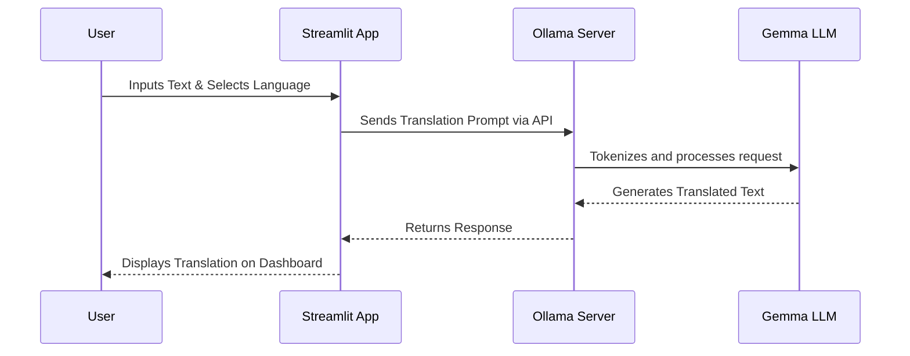

<div align="center">
  
# 🌐 Gemma-Translator

[](https://www.python.org/downloads/)
[](https://streamlit.io)
[](https://ollama.ai)

**An AI-powered, context-aware translation tool running locally with Google's Gemma model.**

</div>

---

## 🚀 Introduction

**Gemma-Translator** is a lightweight, fully private translation application that leverages the power of local Large Language Models (LLMs). By combining a sleek **Streamlit** web interface with **Ollama** for local model hosting, this tool provides highly accurate translations across multiple languages without relying on external APIs or sending your data to the cloud.

Whether you need to translate code documentation, formal emails, or casual conversations, Gemma-Translator understands the nuances and context of your source text.

## ✨ Key Features

* **🔒 100% Local & Private:** Runs entirely on your machine using Ollama. No data is sent to third-party servers.
* **⚡ Streamlit UI:** A clean, responsive, and intuitive web interface for seamless interaction.
* **🧠 Context-Aware:** Powered by the open-weights Gemma model, allowing for translations that grasp idioms and context better than standard dictionary lookups.
* **🌍 Multi-Language Support:** Easily scale to support any language combination handled by the underlying LLM.

## 📐 Architecture & Workflow

### Interactive System Flow



### Static Architecture Diagram


## 🛠️ Installation & Setup

### Prerequisites
1. **Python 3.8+** installed on your system.
2. **[Ollama](https://ollama.ai/download)** installed and running locally.

### Steps to Run

1. **Pull the Gemma Model via Ollama:**
   Open your terminal and run:
   ```bash
   ollama run gemma
   ```
   *(Ensure the model downloads and runs successfully before proceeding.)*

2. **Clone this repository:**
   ```bash
   git clone https://github.com/Aashleshaj/Gemma-Translator.git
   cd Gemma-Translator
   ```

3. **Install dependencies:**
   ```bash
   pip install -r requirements.txt
   ```
   *(Note: Ensure `streamlit` and `langchain` or your specific request libraries are included in `requirements.txt`)*

4. **Launch the application:**
   ```bash
   streamlit run app.py
   ```

5. **Open your browser:** The application will typically be hosted at `http://localhost:8501`.

## 🛣️ Roadmap

- [ ] Add support for document uploads (PDF, TXT, DOCX) for batch translation.
- [ ] Implement translation history caching.
- [ ] Add an evaluation metric module (e.g., integrating Ragas or DeepEval for translation quality assessment).

## 🤝 Contributing

Contributions, issues, and feature requests are welcome! Feel free to check the [issues page](https://github.com/Aashleshaj/Gemma-Translator/issues).

